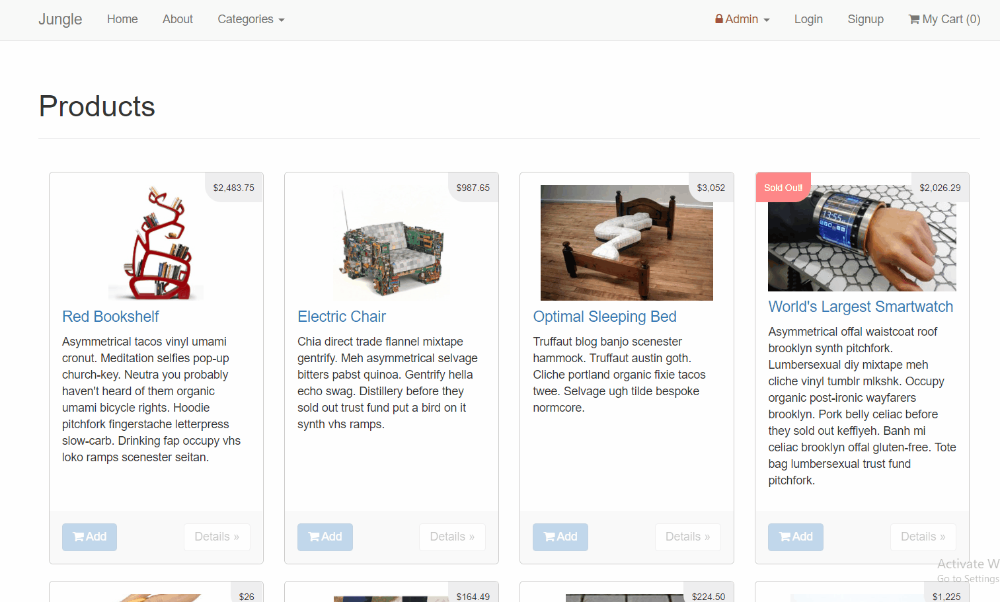

# Jungle

## Project Summary
A mini e-commerce application built with Rails 4.2 for purposes of teaching Rails by example. It is build using Ruby, Rails, postgresSQL and ActiveRecord.

Customers can add items to their shopping cart, filter shown items by categories, add or remove items from their cart, and checkout. Checkout is currently handled using Stripe.

Admins can create additional products and categories. They can also delete existing products and categories.

## Jungle Overview and Filtering

## Jungle Checkout

## Jungle Admin Abilities

## Dependencies

* Rails 4.2 [Rails Guide](http://guides.rubyonrails.org/v4.2/)
* PostgreSQL 9.x
* Stripe
